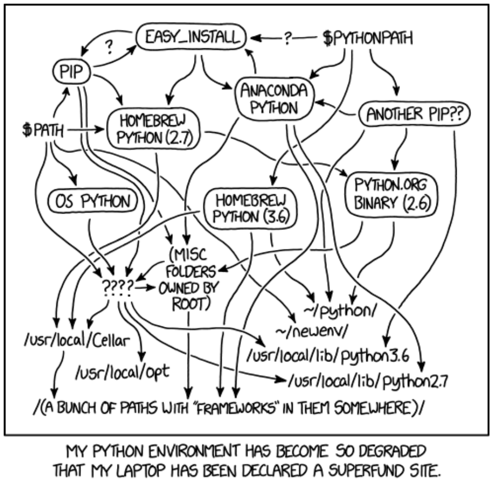

# Report Project Mines ML 2020

Authors: John Doo and Marie Curie

## Recommendations

- You may write this report in French

## How to write a report in markdown

- The syntax is very simple: it's just raw texts with special formatting for titles, images, equations, etc.
- Get a look [here](https://www.markdownguide.org/cheat-sheet/) for a quick guide about the syntax
- Including an image like this:  (*attribution: XKCD.com*)
- Including a table is a bit annoying, but most good editors have plugins to easily edit markdown tables:

| Left-aligned | Center-aligned | Right-aligned |
| :---         |     :---:      |          ---: |
| git status   | git status     | git status    |
| git diff     | git diff       | git diff      |

- For a quotation with reference: "...the **go to** statement should be abolished..." [[1]](#1).

- If you want a PDF version of your report, you may convert it with pandoc:

```
   pandoc -s report.md -o report.pdf
```

or, if you use the img tag, you have to first convert into pure html:

```
pandoc -t html report.md | pandoc -f html -o report.pdf
```

## References
<a id="1">[1]</a> 
Dijkstra, E. W. (1968). 
Go to statement considered harmful. 
Communications of the ACM, 11(3), 147-148.

